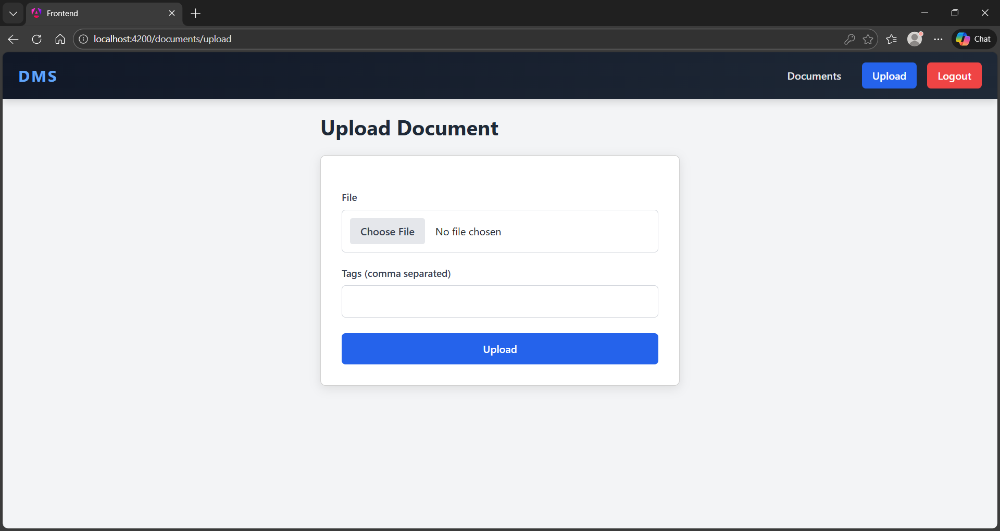
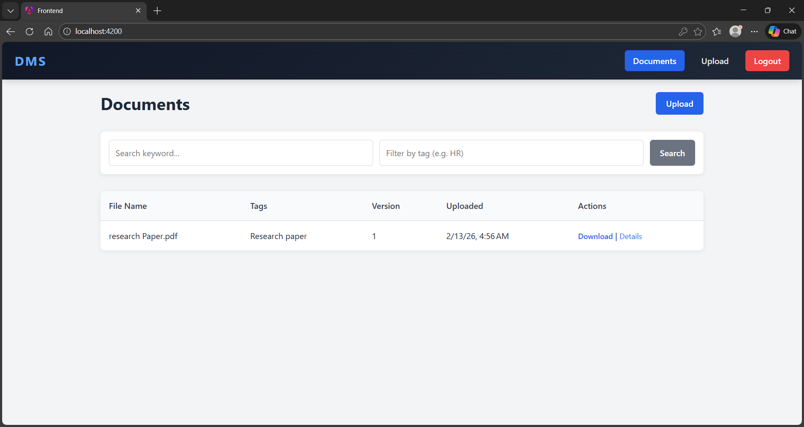
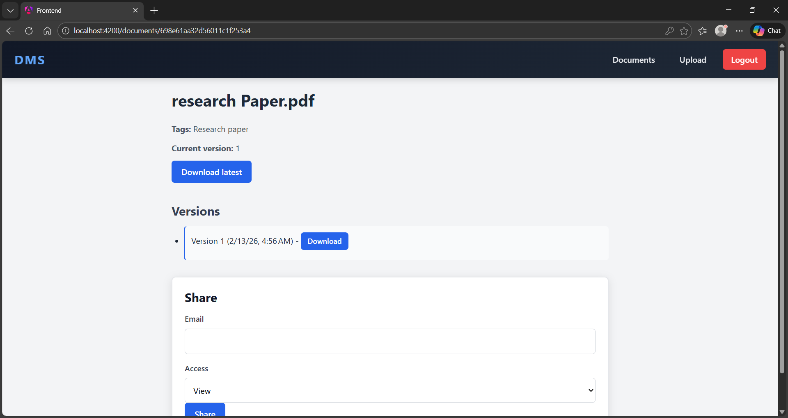

# Document Management System (DMS)

## Overview
This project is a Document Management System (DMS) developed using the MEAN stack (MongoDB, Express.js, Angular, Node.js).  
The system allows users to upload, manage, search, and control access to documents efficiently.
This application is inspired by real-world platforms like Google Drive and SharePoint.


## Tech Stack
- Frontend: Angular 
- Backend: Node.js, Express.js
- Database: MongoDB Atlas
- Authentication: JWT-based authentication
- File Storage: Local storage (can be extended to cloud storage)


## Features

### Core Features
- User Authentication (Login & Registration)
- Upload documents (PDF, images, etc.)
- Add tags and categories to documents
- Search documents by title, keywords, or tags
- Role-based permissions (View / Edit)
- Document version control
- Responsive UI for desktop and mobile

### Must-Have Features
- Responsive webpages
- Secure authentication system

---

## Project Structure

DMS/
├── backend/
├── frontend/
├── screenshots/
└── README.md


## Setup Instructions (Local Environment)

### Prerequisites
- Node.js v18+
- Angular CLI v16+
- MongoDB Atlas account
- Git


### Backend Setup
```bash

cd backend
npm install

```


## Create a .env file:
PORT=5000
MONGO_URI=your_mongodb_connection_string
JWT_SECRET=your_secret_key


Run backend:

npm start

### Frontend Setup

```bash
cd frontend
npm install
ng serve
```

Access application:

http://localhost:4200


## Screenshots

-Login Page


-Dashboard


Document Upload



Search & Filter



Document Details



## Future Enhancements

-Cloud storage integration (AWS S3 / Firebase)
-Advanced document preview
-Audit logs for document changes
-Share documents via links